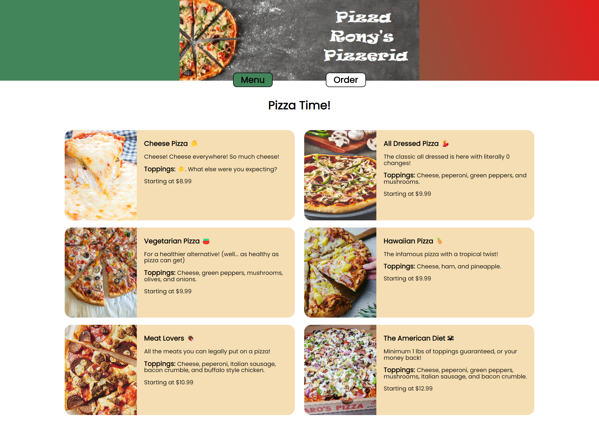
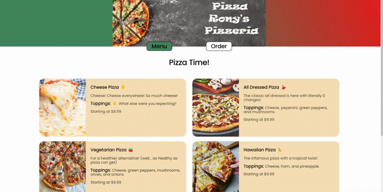
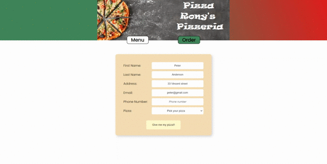

# ⚡ Rony's Pizzeria

## 🟢 About

The primary focus of this frontend project was to gain hands-on experience in fetching and utilizing various React hooks to manipulate data. The backend was purely coded to work flawlessly. Although, it's not directly connected to any database. While the design wasn't my top priority, it still manages to be effective and serves its purpose splendidly. 

## 🟢 Features

- DOM manipulation after state changes (true, false or null).
- Store orders locally and make them accessible at /order/:orderId.
- Secret /admin page to view, update, or delete orders.
- The order form for modification is pre-filled with the stored data.

## 🟢 Demo

## 🟢 Project Setup
#### Server side: 
1. Open a terminal in VS Code
2. Navigate to the server directory with `cd server`
3. Type `yarn install`
4. Use `yarn start` to run the environment

#### Client side:
1. Open a second terminal
2. Navigate to the client directory
3. Type `yarn install`
4. Use `yarn start` to run the frontend environment