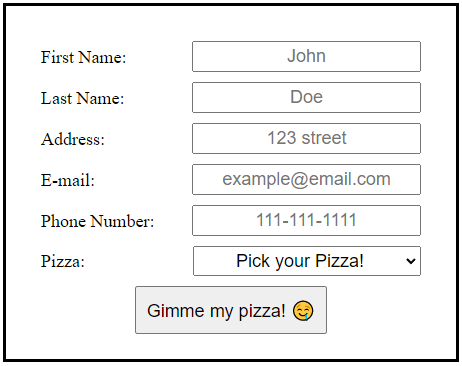
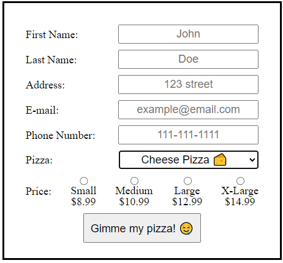

# Exercise 3 - Ordering the Pizza.

Almost done! All that's left is creating the form that will handle the client's order!

Create a new `Route` that navigates to `"/order"`. Render the `Order` component at this address.

In the `Order` component, you'll need to provide the customer with a form to fill and options so that they can choose their pizza and price. The information you want can be found on the server, so you'll have to run another `fetch`! Once you have the necessary info, plug them into your form!

Have some inputs to collect the usual information:
- fiirst name
- last name
- address
- email
- phone number

> PS: Don't forget to handle the `onChange` of the inputs with a `formData` state!

> If you're really **stuck** on how to create the form, take a look at this [hint](hints/hint-1.md).

After the `input` fields, add a `select`. Inside this `select`, you need to `map` the information you got from the server and create one `option` for each pizza.

> For more information on these tags: [select](https://www.w3schools.com/tags/tag_select.asp), [option](https://www.w3schools.com/tags/tag_option.asp).

By now, your form should look a little something like this (but less ugly):

Now the fun begins! We need to display the pricing of the selected pizza! Because each pizza has it's own pricing, we shouldn't display the price until the user has selected a pizza. 

What this means is whenever a `change` is made on the `select` tag, you'll want to `handle` this `change` and make sure you `set` the user's choice (is it obvious yet?). After the user selects a pizza, you should display the pricing information of that pizza.

It should look a little bit like this (but this time just as ugly! I'm joking, try to improve it):

> For more information on the input type radio, click [here](https://www.w3schools.com/tags/att_input_type_radio.asp).

> If you're **stuck** on creating the radio buttons, check out this (**real**) [hint](hints/hint-2.md).

After you have all that, it's time to handle the submission of the form! Run another `fetch`, this time with a `POST` method to send the correct data to the server. 

> The keys required in the body are: `fname`, `lname`, `phone`, `address`, `email`, `price`, and `pizza`.

Oh also, **DO NOT** make any of the inputs `required`. The server will be sending you errors and your job will be to communicate the errors to the user! You can display a message in a box underneath the form or throw an alert. Just as long as you communicate it to the user.

If the order was created successfully, use the [useNavigate](https://reactrouter.com/en/main/hooks/use-navigate) hook from `react-router-dom` to redirect the user to the confirmation page at `"/confirm/:orderId"` (used in the next exercise).

---

## Stretch Goal

In the `PizzaDetail` component, make each size able to navigate to a new `Route` that goes to `"/order/:pizzaId/:size"` which will use **the same `Order` component created above** and pre-choose the selected pizza and the size in the `form` based on the `pizzaId` and `size` URL params. 

---

Remember to look at the [API Documentation](../server/API_DOC.md) to figure out what address you need to `fetch`!

[Back to README](../README.md)