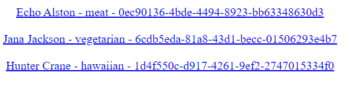
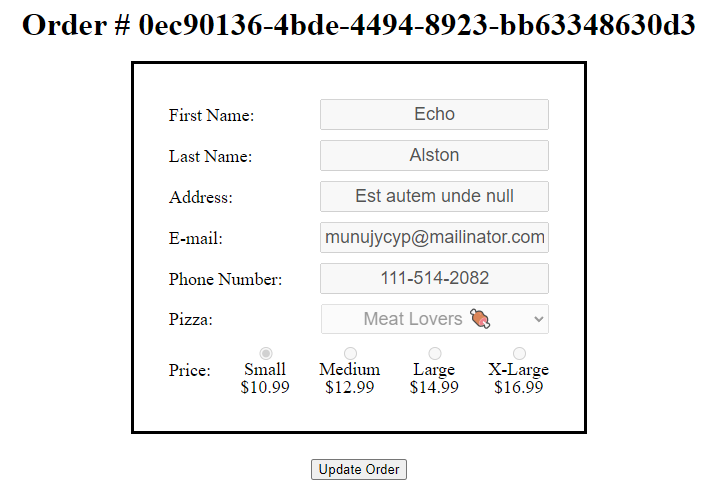

# Exercise 5 - Super Secret Admin Page 🤫

Add a new `Route` at `"/admin"`. _**Do not put it in the `Header`, this is a secret page!**_ Don't forget to create an `Admin` component 😉.

Because this is a super secret admin pannel, you'll want to be able to see all the orders! I'll give you 3 guesses as to what you need to do to get all the orders to display on the page 😋.

The page doesn't have to be anything fancy, this is just a super secret admin pannel after all. Make sure to display all the relevant information an admin would need though:

- name
- last name
- pizza
- order number

It can look like this (and be just as ugly):

Also when the admin clicks on an order, they need to be redirected to the `OrderDetails` page (found at `"/order/:orderId"`), where all the information of the selected order must be displayed! I think you know what to do here 😏.

You can choose to display the information however you want. Personally I recommend recycling the `form` from the `Order` component, and filling it up with the data in this **brand new component**. You'll also need to modify a few of the `fetch`es or the event handlers. Why? It'll make more sense in the next exercise!

> ❗ Notice how everything is disabled? We just want to see the order not edit it... [yet](https://youtu.be/EFPWIjDDcPc)!

---

Remember to look at the [API Documentation](../server/API_DOC.md) to figure out what address you need to `fetch`!

[Back to README](../README.md)